
<!-- Text can be **bold**, _italic_, ~~strikethrough~~ or `keyword` -->

<!-- [Link to another page](./another-page.html). -->

المقالة تشرح واحد من اهم المفاهيم في بيئات الـ Active Directory وهو مفهوم Kerberos Delegation حيث يعتبر البوابة لنقل المستخدمين واعطائهم حق الوصول لـ اصول الشبكة دون الحاجة للوصول بشكل مباشر من قبلهم, يقدم Kerberos Delegation ثلاث انواع للتفويض تم تناول تفاصيل عملها وامكانية استغلال كل نوع .

> المقالة تتطلب فهم كامل لطريقة عمل الـ  Kerberos  + NTLM  authentication protocols

التفويض يحل مشكلة معروفة بالـ Double Hop وب اختصار هي محاولة الوصول باستخدام معلومات الاعتماد الخاصة بك (credentials) بصورة NTLM او Ticket, والاستفادة من موارد الاصول في الشبكة بناء على نوع التفويض المتاح. 

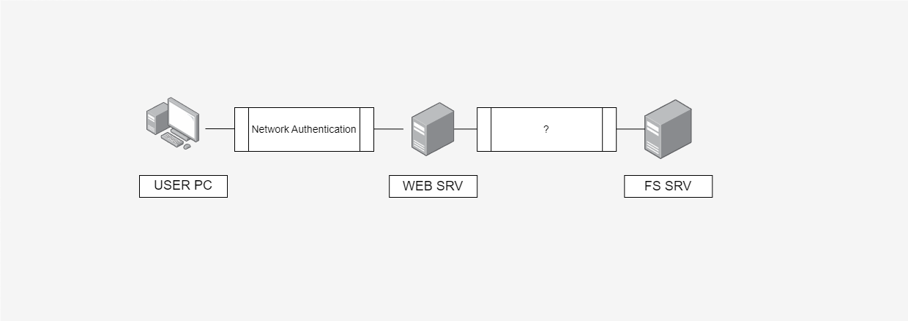

الصورة السابقة توضح عمل التفويض افتراضا ان هنالك خادم File Share يتم التعامل معه عبر خادم ويب لا يمكن الوصول المباشر لخادم File Share من قبل المستخدمين عند تسجيل الدخول كـ يوزر test على جهاز المستخدم (USER PC) -   (Interactive authentication) يتم تخزين الـ credentials الخاصة بـ test في الـ lsass.exe لاستخدامها فيما بعد, عند محاولة الدخول على موقع الويب المستضاف على خادم الويب يقوم USER PC بعمل

 Network Authentication باستخدام credentials الخاصة بـ test المخزنة مسبقا داخل الـ lsass.exe

> لا يتم تخزين الـ credentials في الخادم المراد الوصول له في حالة  Network Authentication.

الصورة السابقة توضح انه في حال عدم تفعيل الـ Delegation على

WEB Server سيتم رفض الاتصال من قبل الـ File Share والسبب يعود ان الـ WEB Server لا يملك اي بيانات اعتماد للمستخدم لارسالها لخادم المشاركة.

قامت مايكروسوفت بداية من Windows 2000 باطلاق اول نوع من انواع التفويض Unconstrained Delegation يليه Constrained Delegation في ـ Windows Server 2003 ثم في Windows 2012 تم تقديم 

Resource Based Constrained Delegation (RBCD) الـ RBCD متفق في العمل مختلف في مكان اعداده, حيث انه يتم على الخادم الاخير في حالتنا يتم اعداده على ال File Share ومنه يتم تحديد الاصول التي تملك صلاحية التفويض من عدمه . 

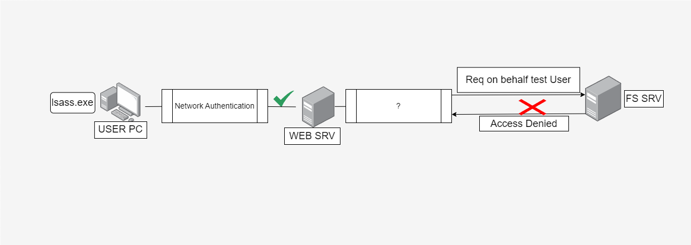
> تتطلب الانواع Unconstrained و Constrained نوع خاص من الصلاحيات SeEnableDelegationPrivilege يتم اعطائه لـ اليوزر القائم على تشغيل خدمة الويب,  يمنح في العادة لـ enterprise and domain admins.

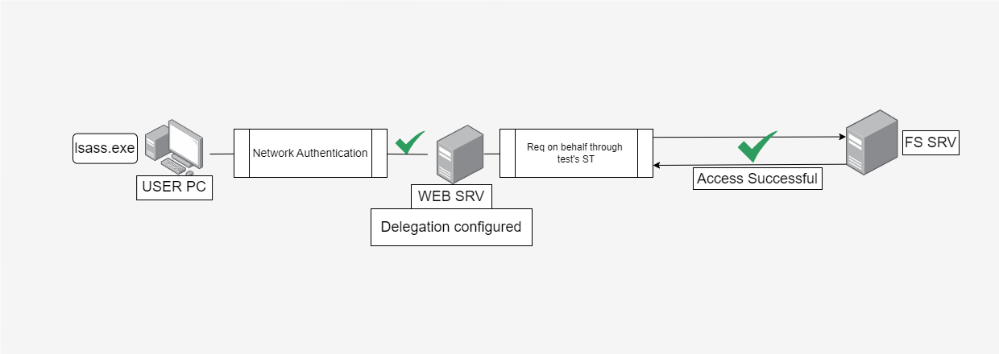

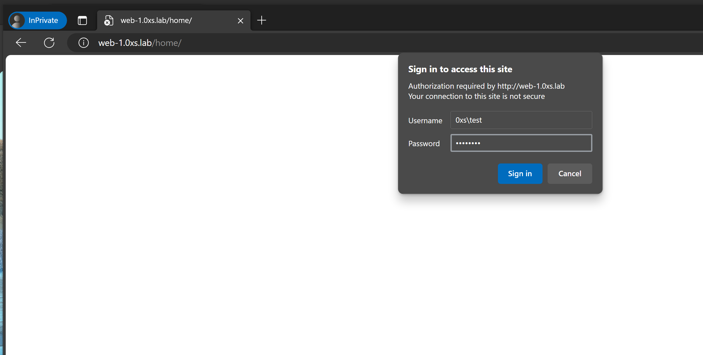

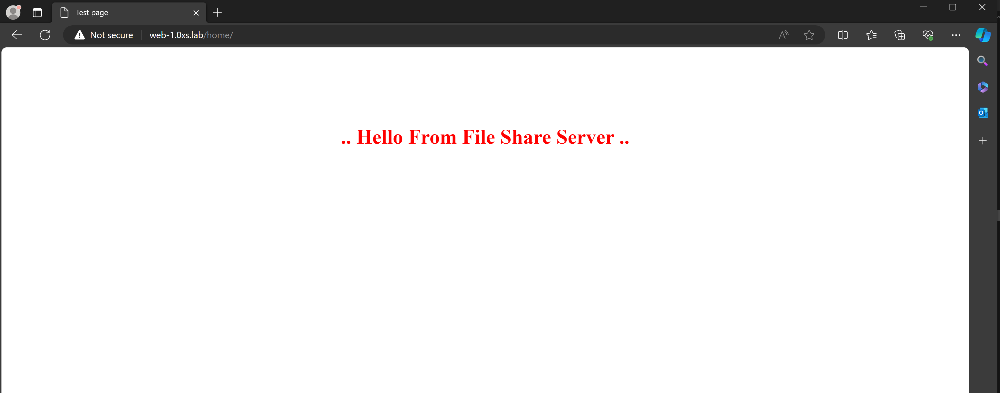

كما هو واضح في الصورة السابقة عند تفعيل التفويض يستطيع WEB Server مخاطبة الـ DC لطلب Ticket من نوع (Service Ticket) ST نيابة عن المستخدم test واستخدامها للوصول الى خادم المشاركة بـ اعتباره المستخدم test. 

>للإختصار سنتجاوز شرح عمل البروتوكلات الخاصة بالتحقق (SSP) 

---

<h1 style="text-align:center; direction:ltr;">
UnConstrained Delegation
</h1> 

يعد النوع الاول من التفويض الاسهل في الاعداد والاسهل في الاستغلال ايضا حيث لإعداده يتطلب الامر تفعيل
 “trust this computer for delegation to any service“ 

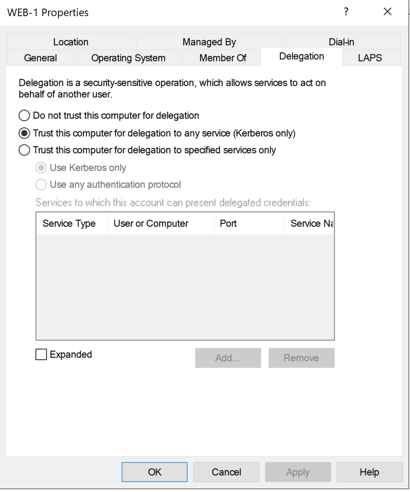

بعد التفعيل يجب ان يحصل الـ Machine Account على الصلاحية الموضحة بالاسفل  

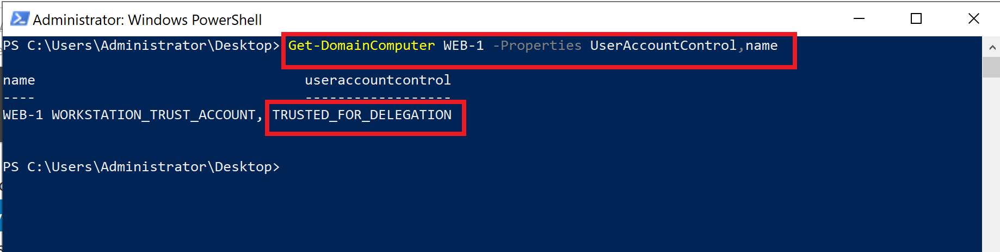

> الحساب WEB-1$ هو الحساب القائم على تشغيل خدمات الويب.

عند طلب المستخدم test الوصول الى ملف home الموجود على خادم المشاركة عن طريق خادم الويب يكون الطلب بالترتيب الموجود في الصورة اسفل..

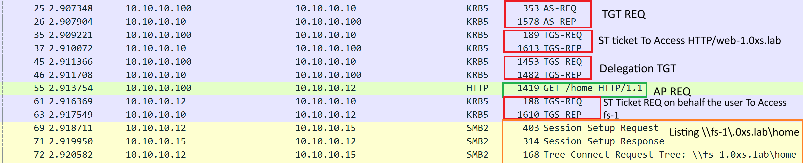
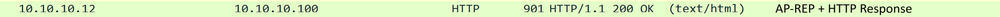

>- DC      IP : 10.10.10.10
>- WEB-1 IP : 10.10.10.12
>- FS-1    IP : 10.10.10.15
>- Client IP : 10.10.10.100

1.  1- طلب TGT من  قبل المستخدم 
1.  2- طلب ST للوصول الى خادم الويب 
1.  3- طلب  TGT اضافية لارسالها الى خادم الويب لاستخدامها بالنيابة عن المستخدم
1. 4- يتم تمرير الـ ST الى خادم الويب التي تحمل بداخلها الـ TGT الاضافية, لتصفح home/ يعرف الطلب هذا بـ AP-REQ
1. 5- بما ان home/ متواجد على خادم اخر في هذه الحالة fs-1 يقوم خادم الويب بطلب ST للمستخدم test من الـ DC للوصول الى fs-1 باستخدام ال TGT المرفقة له في الخطوة رقم 4.
1. 6-يقوم خادم الويب بتمرير ST الى خادم المشاركة نيابة عن المستخدم 
1. 7-يقوم خادم الويب ب إرجاع بيانات المجلد للمستخدم test  يعرف بـ AP-REP

>ماذا لو اردنا طلب ST  لـ اي خادم اخر في الشبكة ..؟

تكمن خطورة هذا النوع من التفويض في طريقة عمله حيث انه يقوم بتخزين تذكرة المستخدم المراد التفويض له مثلا المستخدم test عند استخدام خادم الويب سيقوم خادم الويب بتخزين TGT Ticket الخاصة بالمستخدم test لاستخدامها لمخاطبة الـ DC لطلب (Service Ticket) ST نيابه عن المستخدم  لتمريرها لخادم المشاركة .. النوع هذا من التفويض غير مقيد اي انه عند الاحتفاظ بنسخة من الـ TGT Ticket, تستطيع طلب ST لـ اي خدمة على اي خادم.

عند اختراق خادم الويب نستطيع استغلال التفويض وتكون درجة الخطورة بناء على
TGT Tickets المحفوظة عليه تعود الى اي مستخدم, مثلا يتناول سيناريو الاختراق بالاسفل استغلال TGT Ticket محفوظة,
لـ Domain Admin account - (admin-dom) ..
>جميع سيناريو الاختراقات المذكورة في المقال يتم تطبيقها عن طريق Sliver C2 + Rubeus وبعض الادوات المساعدة.

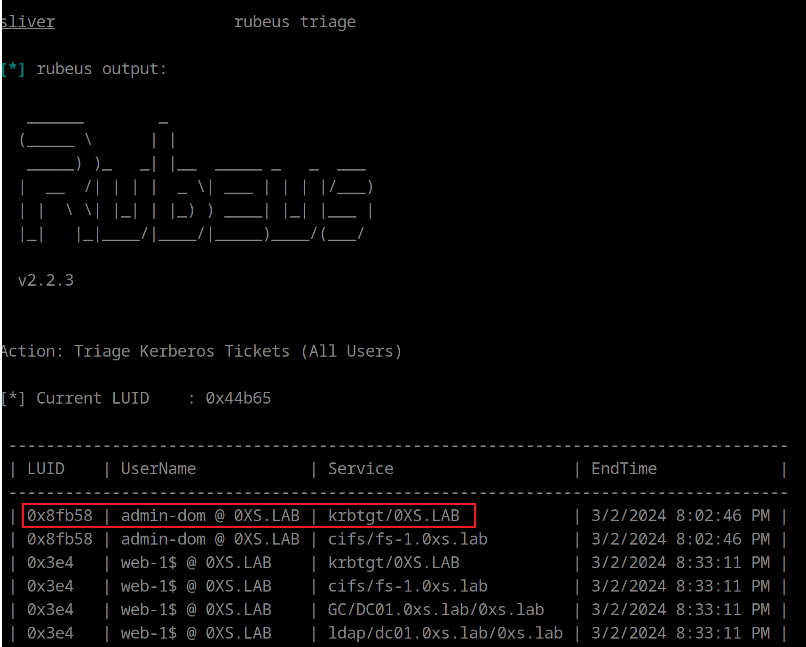
يمكننا الامر triage باستعراض TGT المحفوظة على الخادم في الصورة تم ايجاد تذكرة تعود للمستخدم admin-dom بعد البحث عن المستخدم كما هو موضح بالاسفل تبين ان المستخدم ينتمي لمجموعة الـ Domain Admins.
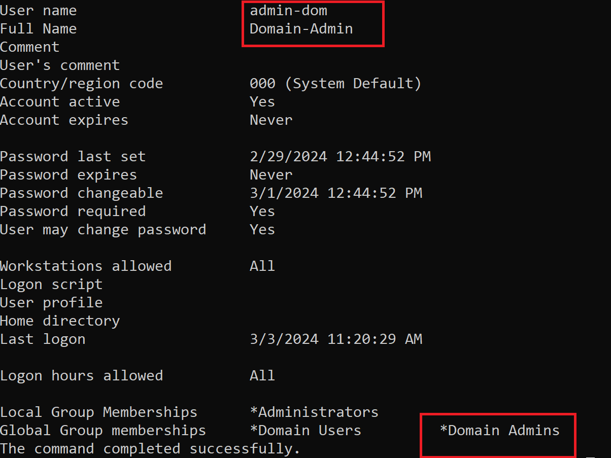
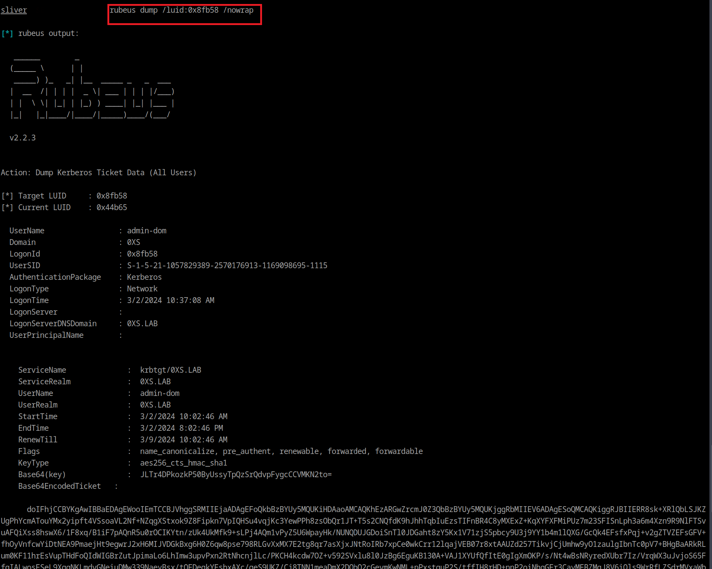

تم استخراج التذكرة الخاصة بالمستخدم بصيغة Base64

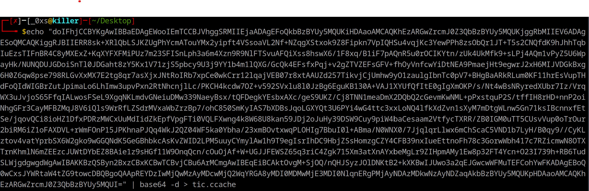

الصورة بالاعلى يتم فيها تحويل التذكرة من Base64 وحفظها بصيغة ccache

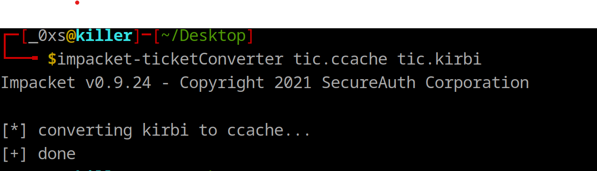

ثم استخدام impacket-ticketConverter  لتحويل التذكرة من صيغة ccache الى صيغة Kirbi 

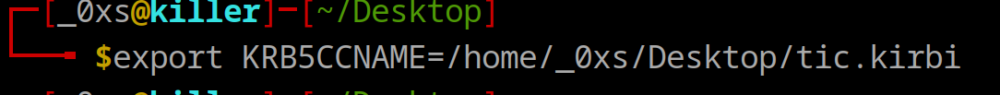
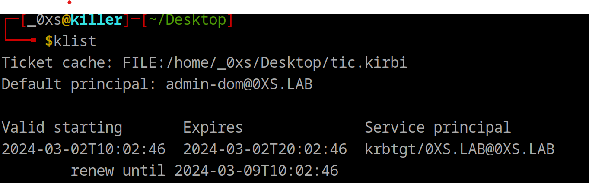

بعد استخدام export لاستخدام التذكرة في نظام لينكس يمكنك التحقق منها عبر الامر klist .

بعد الانتهاء من اعداد استخراج التذكرة الخاصة بالمستخدم admin-dom وتهيئتها للاستخدام وبعد المعرفة بانه مستخدم ذو صلاحية عالية يمكننا الاتصال باستخدام التذكرة مباشرة بالـ DC باستخدام, psexec كما هو موضح بالاسفل . 

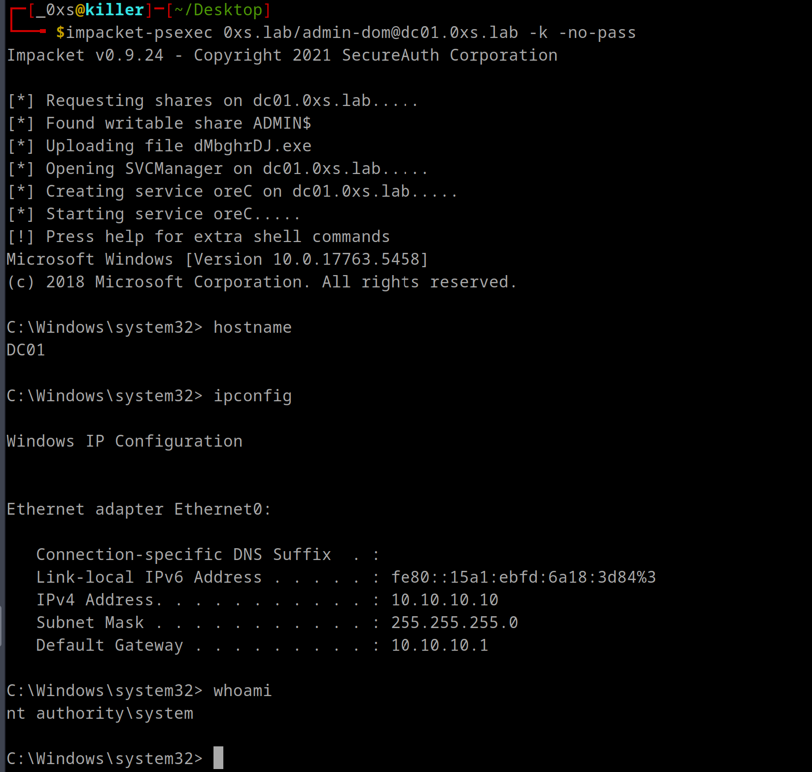
>يتم تمرير k -no-pass- لعدم طلب كلمة مرور واستخدام التذكرة الموجودة مسبقا .

